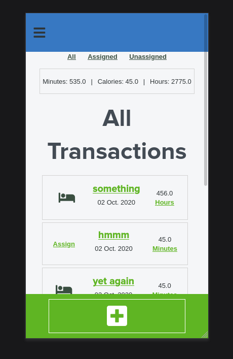
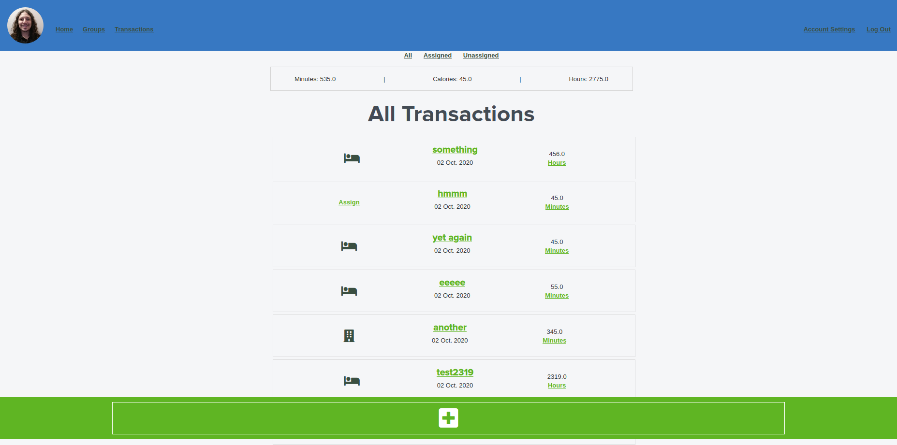

# Tracker Keeper

> A web app to track any sort of transaction you need to. Transactions could be as simple as the amount you spent at the store or the amount of time spent working, but you can also track multiple types of transactions so you can watch your calories, time sleeping, time working, and money spent. Users are allowed to create unique amount types and attach unique group icons in order to best represent the type of transaction they are tracking. Each user's experience can be custom tailored to their needs.

### Features

-   Create custom groups with icons
-   Create custom amount types
-   Create transactions to record anything (time, money, calories, etc)
-   View transactions based on associated groups or amount type
-   Log in with GitHub credentials
-   Responsive design for desktop or mobile use
-   Upload profile picture
    -   Saved on local server and subject to deletion: currently set up as proof of concept

###### Coming Features

-   Integration with cloud storage for persistent profile picture
-   Filter transactions to display by day, week, month, or year
-   Customizable color scheme
-   Separate display of transactions for only logged in user
    -   Show user list and friendships to connect and see other user transactions on profile or in groups / types
-   Ambee updates for time and weather

## Built With

-   Ubuntu
-   Atom
-   HTML / SCSS / jQuery / Ruby
-   Ruby on Rails

## Live Demo

Click the [Live Link](https://vast-basin-15172.herokuapp.com/) to visit this site now!

## Getting Started

To get a local copy up and running follow these simple example steps.

#### Prerequisites

Ruby: 2.7  
Rails: 6

#### Setup

1.  Clone this repository with `git clone` [`https://github.com/defoebrand/Tracker-Keeper.git`](https://github.com/defoebrand/Tracker-Keeper.git) using a terminal or command line.
2.  Direct your terminal to the project folder by entering `cd Tracker-Keeper`
3.  Run `bundle install` to install the necessary dependencies
4.  Check the config/database.yml file for matching username and password for your local postgres database
5.  Run `rails db:setup` to setup your local database.
6.  Run `rails db:migrate` to setup your database schema.
7.  Run `rails server` to start the application.
8.  Finally, direct your browser to '<http://localhost:3000/>' to view the app.

### Testing

> To run tests open the terminal inside the project's root directory and run `rspec`

## Authors

👤 **Brandon Defoe**

-   Github: [@defoebrand](https://github.com/defoebrand)
-   LinkedIn: [@defoebrand](https://www.linkedin.com/in/defoebrand/)
-   Gmail: <mailto:defoe.brand@gmail.com>

## Show your support

Give a ⭐️ if you like this project!

## Acknowledgments

-   Microverse
-   [Gregoire Vella](https://www.behance.net/gregoirevella)� and his design, which can be seen [here](https://www.behance.net/gallery/19759151/Snapscan-iOs-design-and-branding?tracking_source=).

## 📝 License

This project is [MIT](lic.url) licensed.
